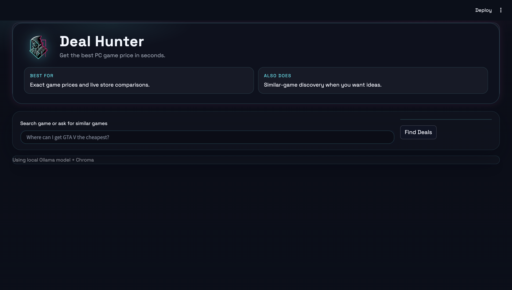
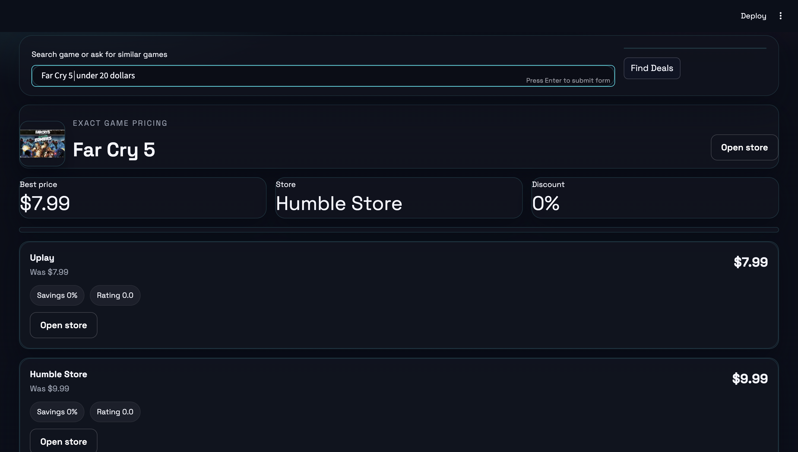
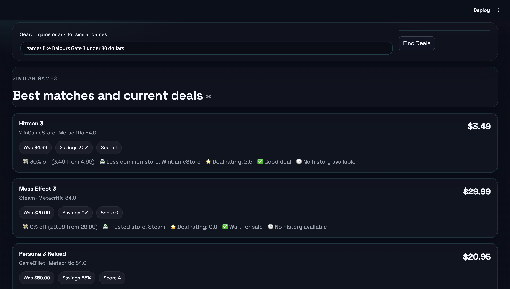
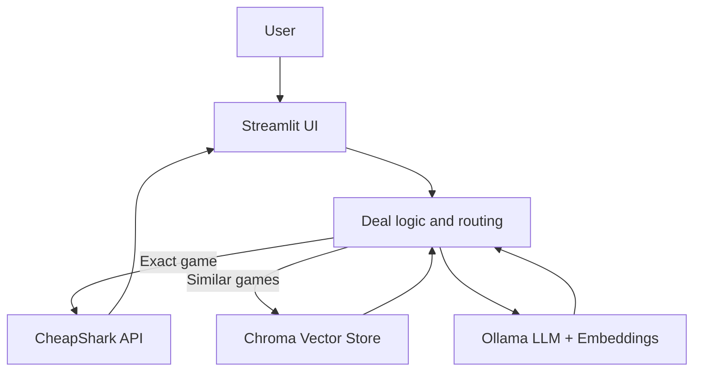

# Deal Hunter

Deal Hunter finds the cheapest current PC game deals and handles similar-game discovery when you want recommendations instead of an exact title.

The app uses local Ollama for reasoning, CheapShark for live pricing, and persistent local Chroma for semantic search. Pinecone is still supported as an optional cloud backend, but the current working setup is Chroma-first.

## What It Does

- Finds the cheapest current price for a specific game.
- Shows all available store prices and direct links.
- Finds similar games when the user asks for recommendations.
- Uses alias matching for titles like GTA V, GTA 5, and Grand Theft Auto V.
- Keeps AI reasoning local and free with Ollama.
- Persists semantic search data locally so the catalog can grow without a hosted quota.

## Current Data

- Catalog size depends on the last dataset rebuild.
- Last rebuild: 422 games and 422 embeddings (May 31, 2026).
- Chroma persistence lives in `data/chroma_persist`.

## How It Works

```text
User types a query in Streamlit
  -> app checks whether it is an exact game query
  -> exact game: fetch all CheapShark deals for that title
  -> discovery query: use the configured vector store (currently Chroma, Pinecone optional) to find similar games
  -> rank results and build explanations
  -> show best deal first with store links
```

## Project Structure

```text
.
├── app/                # application code
├── assets/             # brand assets like the logo
├── data/               # game CSVs and cache files
├── docs/               # project guide and screenshots
├── scripts/            # dataset and vectorstore setup scripts
├── main.py             # Streamlit entry point
├── README.md           # this guide
├── pyproject.toml      # project metadata
├── requirements.txt    # dependency list
└── .streamlit/         # Streamlit config
```

## Main Files

| File | Purpose |
| --- | --- |
| `main.py` | Launches the Streamlit app. |
| `app/ui.py` | Builds the full user interface. |
| `app/agent.py` | Coordinates exact-game and discovery flows. |
| `app/cheapshark.py` | Talks to CheapShark and returns live deals. |
| `app/vectorstore.py` | Handles vector-store search and persistence. |
| `app/games_db.py` | Loads the game catalog and resolves aliases. |
| `app/preferences.py` | Stores session preferences and parses the query. |
| `app/deal_logic.py` | Scores deals and builds explanations. |
| `app/models.py` | Pydantic models for games, deals, and recommendations. |

## Setup

1. Install Ollama: https://ollama.ai
2. Pull models:
   ```bash
   ollama pull llama3.2:latest
   ollama pull nomic-embed-text
   ```
3. Start Ollama:
   ```bash
   ollama serve
   ```
4. Create and sync the environment:
   ```bash
   uv venv
   source .venv/bin/activate
   uv sync
   ```
5. Copy `.env.example` to `.env`.
6. Set `VECTORSTORE_BACKEND=chroma` and `CHROMA_PERSIST_DIR=./data/chroma_persist` for the current local build.
7. Set `PINECONE_API_KEY` only if you want to use Pinecone instead of Chroma.

## Build the Data

```bash
python scripts/build_games_database.py
python scripts/generate_game_embeddings.py
# Current default: Chroma (local)
python scripts/chroma_setup.py
# Optional cloud alternative
python scripts/pinecone_setup.py
```

## Run the App

```bash
streamlit run main.py
```

## Example Queries

- Where can I get GTA V the cheapest?
- Games like Baldur's Gate 3 under $30
- Best story-driven games on sale
- Fast-paced shooters under $20

## Notes

- The vector database improves discovery, not the size of the catalog.
- For a direct title query, Deal Hunter shows one game only.
- For similar-game queries, it shows the best matching games and current prices.
- Chroma is the active local backend right now; Pinecone remains supported as an optional alternative.
- If the query includes a price limit (for example, "under $20"), only deals at or below that amount are returned.

## Deployment Notes

- Local: `streamlit run main.py` with Ollama running.
- Cloud: Streamlit can be deployed, but Ollama still needs to run locally.

## Screenshots

#Home


#Exact Game Pricing  


#Similar Games Recommendation


## Architecture



## License

MIT
